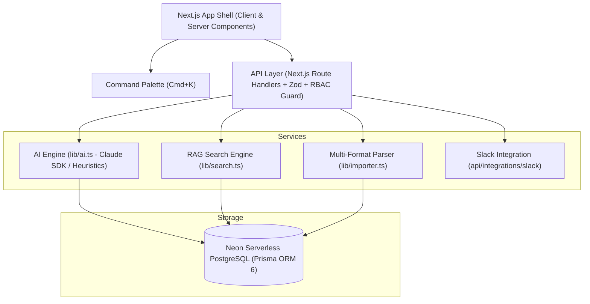

# Project LOOP — AI Customer-Feedback Intelligence Platform

> **Corporate-Grade Voice-of-Customer (VoC) Intelligence & Automated Feedback Analytics Engine**

Project LOOP is a modern, enterprise-ready web application built for SaaS product management teams, customer support leaders, and executive founders. It ingests customer feedback across multi-channel streams—support tickets, app store reviews, survey responses, sales call notes, community posts, uploaded documents, and inbound API webhooks—and transforms unstructured customer text into actionable, evidence-backed product decisions.

Powered by **Anthropic Claude AI** (with heuristic NLP fallbacks), **Neon Serverless PostgreSQL**, **Prisma ORM 6**, and **Next.js 16 (App Router)**, LOOP automatically classifies sentiment, clusters recurring themes, flags week-over-week volume spikes, powers semantic retrieval Q&A (Ask LOOP RAG), and synthesizes executive Voice-of-Customer (VoC) digests.

---

## 🌟 Key Features

### 1. Multi-Tenant Workspaces & Role-Based Access Control (RBAC)
- **Strict Data Isolation**: Every database query is scoped strictly by `workspaceId`. Cross-tenant data leakage is prevented at the database and API layer.
- **Three Access Roles**:
  - `ADMIN`: Full access (ingestion, triage workflow, team role management, webhook keys, data deletion).
  - `ANALYST`: Ingest feedback, bulk document import, triage status updates, AI re-classification, VoC reports.
  - `VIEWER`: Read-only access across analytics dashboards, inbox triage, trends, Ask LOOP, and reports.
- **Team Management**: Invite workspace team members, manage assigned roles, and view workspace API credentials.

### 2. Ingestion Engine & Multi-Format Document Importer
- **Single-Entry Ingestion Form**: Manual feedback creation with Zod runtime schema validation.
- **Multi-Format Bulk Document Importer**: Ingest customer feedback files in bulk with native parsing for:
  - **CSV** (`.csv`) via `papaparse`
  - **Excel Spreadsheets** (`.xlsx`, `.xls`) via `xlsx`
  - **Word Documents** (`.docx`) via `mammoth`
  - **PDF Documents** (`.pdf`) via `pdf-parse`
  - **JSON & Plain Text** (`.json`, `.txt`)
  - Features pre-flight header detection, key normalization, column mapping preview, duplicate row detection, and detailed validation summaries.
- **Simulated Channel Connectors**: 1-click sync triggers for Zendesk Support Tickets, App Store & Play Store Reviews, SurveyMonkey NPS, and HubSpot Sales Call Notes.
- **Inbound Webhook API**: Secure external API endpoint (`POST /api/webhooks/ingest`) authorized via workspace API keys (`x-api-key`), enabling automated background ingestion from third-party services.

### 3. Real-Time Integrations & Slack Alerts
- **Slack Alerting Integration**: Configure outbound Slack Webhooks in workspace settings to automatically dispatch real-time channel alerts whenever high-priority or negative feedback is classified.

### 4. Global Command Palette (`Cmd+K` / `Ctrl+K`)
- Instant keyboard-driven navigation modal allowing team members to jump between core app sections (Dashboard, Inbox, Trends, Ask LOOP, Reports, Settings) or trigger fast actions (Feedback Ingestion, VoC Export).

### 5. Feedback Triage Inbox
- **Server-Side Pagination**: High-performance pagination optimized for large feedback data volumes.
- **Multi-Filter & Full-Text Search**: Filter by Channel, Sentiment, Priority Level (`LOW` | `MEDIUM` | `HIGH` | `URGENT`), Theme, Status, and Date Range.
- **Interactive Workflow**: Transition feedback items across statuses (`NEW` → `REVIEWED` → `ACTIONED`).
- **AI Re-Classification**: On-demand trigger to refresh or correct AI sentiment scores, theme associations, and rationale.

### 6. Executive Analytics Dashboard
- Dynamic **Recharts** analytics suite:
  1. **Volume & Sentiment Over Time**: Daily velocity area chart comparing positive, neutral, and negative customer sentiment.
  2. **Sentiment Distribution**: Donut breakdown chart.
  3. **Top Themes**: Horizontal bar chart distribution across feature domains.
  4. **Channel Breakdown**: Source volume distribution across ingestion streams.
- Metric Stat Cards: Total Items, % Negative Sentiment, Actioned Rate, and New Weekly Volume.

### 7. AI Engine Suite
- **AI1 — Auto-Classification**: Detects sentiment (`POSITIVE`, `NEUTRAL`, `NEGATIVE`), sentiment score (`-1.0` to `+1.0`), feature area, theme association, priority level, and AI rationale on ingest.
- **AI2 — Theme Clustering & WoW Trends**: Identifies week-over-week volume spikes (`+X% WoW`), flags spiking friction themes with visual alerts, and opens detailed item drill-down modals.
- **AI3 — Ask LOOP (Grounded RAG Q&A)**: Semantic vector retrieval across workspace feedback, returning natural language answers grounded in customer quotes with evidence citations.
- **AI4 — Voice-of-Customer (VoC) Executive Reports**: Synthesizes executive summaries, metric deltas, verbatim customer quotes, and strategic recommendations for 7-day, 30-day, or 90-day windows. Supports 1-click PDF print export.

### 8. Audit Logging & System Tracking
- System audit log history (`AuditLog`) recording key workspace activities (feedback ingestion, bulk document imports, channel simulations, and member role updates).

---

## 🛠️ Tech Stack

| Domain | Technology |
| :--- | :--- |
| **Framework** | Next.js 16 (App Router) + React 19 + TypeScript |
| **Styling** | Tailwind CSS v4 (Corporate Dark Theme, Glassmorphism UI) |
| **Database & ORM** | Neon Serverless PostgreSQL + Prisma ORM 6 |
| **AI Integration** | Anthropic Claude API (`@anthropic-ai/sdk`) + Heuristic NLP Engine |
| **Document Parsers** | `papaparse` (CSV), `xlsx` (Excel), `mammoth` (Word), `pdf-parse` (PDF) |
| **Visualizations** | Recharts v3 |
| **Data Validation** | Zod v4 |
| **Authentication** | Session JWT Cookies with `bcrypt` password hashing |
| **Icons** | Lucide React |

---

## 🏗️ System Architecture



---

## 📁 Directory Structure

```
loop/
├── app/
│   ├── (auth)/             # Authentication pages (Login, Signup)
│   ├── (app)/              # Authenticated App Shell
│   │   ├── dashboard/      # Recharts analytics dashboard
│   │   ├── inbox/          # Paginated feedback triage inbox
│   │   ├── trends/         # Theme clustering & WoW spike alerts
│   │   ├── ask/            # Ask LOOP RAG semantic Q&A
│   │   ├── reports/        # Executive VoC digests & PDF export
│   │   └── settings/       # Workspace team, API key & Slack settings
│   └── api/                # REST Route Handlers
│       ├── ask/            # RAG semantic search endpoint
│       ├── auth/           # Login, Signup, Me, Logout
│       ├── feedback/       # Ingest, list, patch status, re-classify
│       ├── import/         # Multi-format document parser upload
│       ├── integrations/   # Slack webhook notifications
│       ├── members/        # Workspace team & RBAC management
│       ├── reports/        # VoC digest generator
│       ├── settings/       # Workspace settings & API key rotation
│       ├── themes/         # Theme list & spike calculation
│       └── webhooks/       # Inbound API key webhook ingestion
├── components/             # UI Components (Navbar, Sidebar, CommandPalette, Modals, StatCards)
├── lib/
│   ├── ai.ts               # Anthropic Claude SDK & Heuristic NLP engine
│   ├── audit.ts            # Audit logging utility
│   ├── auth.ts             # JWT Session authentication & RBAC guards
│   ├── db.ts               # Prisma Client singleton
│   ├── importer.ts         # Multi-format document parser (CSV, XLSX, DOCX, PDF, JSON)
│   ├── search.ts           # RAG keyword & token vector similarity search
│   └── validations/        # Zod schemas for import & ingestion
└── prisma/
    ├── schema.prisma       # Database schema (Workspaces, Users, Feedback, Themes, Reports, AuditLogs)
    └── seed.ts             # 125+ item realistic seed script
```

---

## 🗄️ Database Schema Summary

The relational PostgreSQL database managed via Prisma ORM 6 includes 8 primary models:

- **`Workspace`**: Tenant workspace with name, inbound API key (`apiKey`), outbound Slack webhook URL (`slackWebhookUrl`), and timestamps.
- **`User`**: Team members with password hash (`bcrypt`), assigned role (`ADMIN` | `ANALYST` | `VIEWER`), and workspace association.
- **`Feedback`**: Feedback records with content, channel, sourceRef, customer metadata (`customerName`, `customerEmail`, `company`, `customerLabel`), `rating`, `title`, `product`, `tags`, `priority` (`LOW` | `MEDIUM` | `HIGH` | `URGENT`), `language`, `sentiment`, `sentimentScore`, `status` (`NEW` | `REVIEWED` | `ACTIONED`), `featureArea`, and `rationale`.
- **`Theme`**: Cluster topics with descriptions and badge color hex codes.
- **`FeedbackTheme`**: Join entity linking feedback entries to themes with AI confidence scores.
- **`Embedding`**: Vector JSON representations for semantic retrieval.
- **`Report`**: Saved executive VoC reports containing generated metric summaries, verbatim quotes, and action items.
- **`AuditLog`**: System activity history logs recording key operations per workspace user.

---

## 📋 Prerequisites

- **Node.js**: v18.0.0 LTS or newer
- **npm** or **yarn** or **pnpm**
- **Git**
- **Neon PostgreSQL Database** (or any compatible PostgreSQL connection URI)

---

## ⚙️ Environment Variables

Create a `.env` file in the root directory:

```env
# Neon Serverless PostgreSQL Connection String
DATABASE_URL="postgresql://<user>:<password>@<neon-hostname>/<dbname>?sslmode=require"

# JWT Secret for Session Cookies
NEXTAUTH_SECRET="your-super-secret-jwt-key"

# Optional: Anthropic Claude API Key (Heuristic engine activates automatically if omitted)
ANTHROPIC_API_KEY="your-anthropic-claude-api-key"
```

---

## 🚀 Quick Start & Installation

### 1. Clone Repository & Install Dependencies
```bash
git clone <repository-url>
cd loop
npm install
```

### 2. Configure Database & Run Migrations
Push the database schema to your Neon PostgreSQL instance:
```bash
npx prisma db push
```

### 3. Seed Initial Demo Data
Populate 125+ realistic feedback items across 5 channels, 6 core themes, demo users, and VoC report digests:
```bash
npm run seed
```

### 4. Start Development Server
```bash
npm run dev
```
Open [http://localhost:3000](http://localhost:3000) in your browser.

---

## 🔌 API Endpoints Reference

| Method | Endpoint | Description | Auth Required |
| :--- | :--- | :--- | :--- |
| `POST` | `/api/auth/login` | Authenticate user & issue JWT session cookie | Public |
| `POST` | `/api/auth/signup` | Register new account & create workspace | Public |
| `GET` | `/api/auth/me` | Retrieve active user session profile | Session |
| `POST` | `/api/auth/logout` | Revoke session cookie | Session |
| `GET` | `/api/feedback` | List paginated feedback with filters & search | Session |
| `POST` | `/api/feedback` | Ingest single feedback item & run AI classification | Session (`ADMIN`, `ANALYST`) |
| `PATCH` | `/api/feedback/[id]` | Update feedback status or trigger AI re-classification | Session (`ADMIN`, `ANALYST`) |
| `DELETE` | `/api/feedback/[id]` | Delete feedback record | Session (`ADMIN`) |
| `POST` | `/api/import` | Multi-format document parser upload (`.csv`, `.xlsx`, `.docx`, `.pdf`, `.json`) | Session (`ADMIN`, `ANALYST`) |
| `POST` | `/api/feedback/simulate` | Trigger 1-click simulated channel sync | Session (`ADMIN`, `ANALYST`) |
| `POST` | `/api/webhooks/ingest` | Inbound API key feedback ingestion | API Key (`x-api-key`) |
| `POST` | `/api/integrations/slack` | Trigger outbound Slack webhook notifications | Session |
| `GET` | `/api/themes` | List themes with feedback counts & WoW spike metrics | Session |
| `POST` | `/api/ask` | Execute Ask LOOP RAG semantic vector Q&A | Session |
| `GET` | `/api/reports` | List generated VoC reports | Session |
| `POST` | `/api/reports` | Synthesize new executive VoC report | Session (`ADMIN`, `ANALYST`) |
| `GET` | `/api/members` | List workspace team members & API key | Session |
| `POST` | `/api/members` | Invite new member with assigned role | Session (`ADMIN`) |
| `PATCH` | `/api/settings` | Update workspace name or Slack Webhook URL | Session (`ADMIN`) |

---

## 🔑 Demo Credentials

Preset evaluator test accounts configured in the seed script:

| Role | Email | Password | Allowed Capabilities |
| :--- | :--- | :--- | :--- |
| **Admin** | `admin@acme.com` | `password123` | Full Access (Ingest, Triage, Role Management, Webhook Key, Delete) |
| **Analyst** | `analyst@acme.com` | `password123` | Ingest, Bulk Document Import, Triage Updates, AI Re-classify, VoC Reports |
| **Viewer** | `viewer@acme.com` | `password123` | Read-Only (Dashboard, Inbox, Trends, Ask LOOP, Reports) |

---

## ☁️ Production Deployment (Vercel)

1. Connect the repository to your **Vercel** workspace.
2. In Vercel Project Settings, configure Environment Variables:
   - `DATABASE_URL` (Your Neon PostgreSQL pooled connection string)
   - `NEXTAUTH_SECRET`
   - `ANTHROPIC_API_KEY` (Optional)
3. Deploy! The `postinstall` script (`prisma generate`) will run automatically during Vercel build phase.

---

## 📜 License

Confidential — Prepared for Zidio Development Internship Program.
